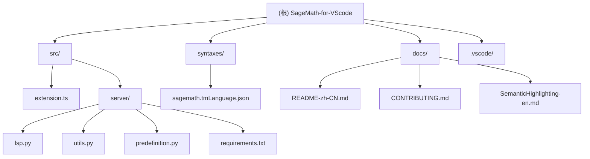

# SageMath for VSCode - AI Context Document

## 变更记录 (Changelog)

### 2026-01-28 22:12:01
- 初始化 AI 上下文文档
- 完成项目架构扫描和模块分析
- 生成根级和模块级文档

---

## 项目愿景

SageMath for VSCode 是一个为 Visual Studio Code 提供 SageMath 语言支持的扩展。其核心目标是：

1. **语法高亮**：为 SageMath 代码提供准确的语法高亮
2. **语义高亮**：基于 LSP 实现语义级别的代码高亮，区分函数、类、变量、方法等
3. **代码执行**：支持快捷键、命令按钮直接运行 SageMath 文件
4. **Conda 环境支持**：允许用户选择和切换不同的 Conda 环境
5. **自动清理**：运行后自动删除生成的 `.sage.py` 中间文件

项目致力于成为功能完整的 SageMath IDE 支持，特别是通过 Language Server Protocol (LSP) 提供智能代码分析能力。

---

## 架构总览

### 技术栈
- **扩展主机**：TypeScript (Node.js)
- **语言服务器**：Python (pygls)
- **通信协议**：Language Server Protocol (LSP)
- **语法高亮**：TextMate 语法 (JSON)

### 系统架构

扩展采用客户端-服务器架构：

```
┌─────────────────────────────────────────────────────────┐
│                   VS Code 扩展主机                        │
│  ┌──────────────────────────────────────────────────┐  │
│  │  extension.ts (TypeScript)                       │  │
│  │  - 命令注册与处理                                  │  │
│  │  - LSP 客户端启动                                  │  │
│  │  - Conda 环境管理                                  │  │
│  │  - 终端集成                                       │  │
│  └──────────────────────────────────────────────────┘  │
│                          ↕ stdio                        │
│  ┌──────────────────────────────────────────────────┐  │
│  │  Language Server (Python)                        │  │
│  │  - lsp.py: LSP 协议处理                            │  │
│  │  - utils.py: 词法分析与语义分类                    │  │
│  │  - predefinition.py: SageMath 标准库定义           │  │
│  └──────────────────────────────────────────────────┘  │
└─────────────────────────────────────────────────────────┘
```

### 关键流程

#### 1. 扩展激活流程
```
activate()
  ├─ 注册命令: runSageMath, restartLSP, selectCondaEnv
  ├─ 检查 LSP 配置
  ├─ 检查 venv (envLSP) 是否存在
  │   ├─ 不存在 → 创建 venv 并安装依赖
  │   └─ 存在 → 启动 LSP 服务器
  └─ 显示状态栏按钮
```

#### 2. 代码执行流程
```
runSageMath 命令
  ├─ 保存当前文件
  ├─ 获取配置: sage.path, condaEnvPath
  ├─ 查找或创建终端
  ├─ 激活 Conda 环境 (如配置)
  └─ 执行: cd <dir> && sage <file>.sage; rm -f <file>.sage.py
```

#### 3. LSP 语义分析流程
```
文本变更
  ↓
doc_to_tokens() - 词法分析
  ├─ 分词: 符号、运算符、数字、字符串、注释
  └─ 生成 Token 列表
  ↓
classify_tokens() - 语义分类
  ├─ 识别关键字 (def, class, import, for 等)
  ├─ 识别函数定义和方法定义
  ├─ 识别类定义和属性
  ├─ 识别变量和常量
  └─ 匹配预定义的 SageMath 类型 (ZZ, QQ, Matrix 等)
  ↓
semantic_tokens() - 生成 LSP Token
  └─ 返回给 VS Code 进行语义高亮
```

---

## 模块结构图



---

## 模块索引

| 模块路径 | 职责 | 语言 | 入口文件 | 测试 |
|---------|------|------|---------|------|
| `src/` | VS Code 扩展主入口 | TypeScript | `extension.ts` | ❌ |
| `src/server/` | SageMath LSP 服务器 | Python | `lsp.py` | ❌ |
| `syntaxes/` | TextMate 语法定义 | JSON | `sagemath.tmLanguage.json` | - |
| `docs/` | 项目文档 | Markdown | - | - |
| `.vscode/` | 开发配置 | JSON | - | - |

---

## 运行与开发

### 环境要求
- **Node.js**: >= 20.x
- **Python**: >= 3.10 (用于 LSP)
- **SageMath**: 系统已安装 sage 命令
- **Conda**: 可选，用于环境切换

### 开发设置

1. **安装依赖**
   ```bash
   npm install
   ```

2. **编译 TypeScript**
   ```bash
   npm run compile
   ```

3. **监听模式**
   ```bash
   npm run watch
   ```

4. **运行测试**
   ```bash
   npm test
   ```

5. **调试扩展**
   - 按 `F5` 启动扩展开发主机
   - 或使用 `.vscode/launch.json` 配置

### LSP 服务器依赖

LSP 服务器使用独立的 Python 虚拟环境 (`src/server/envLSP/`)：

**依赖列表** (`src/server/requirements.txt`):
- `pygls==1.3.1` - Python LSP 框架

首次启动时，扩展会自动：
1. 创建 `src/server/envLSP/` 虚拟环境
2. 使用 `sage -python -m venv` 确保与 SageMath 兼容
3. 安装 requirements.txt 中的依赖

### 发布打包

```bash
# 使用 vsce 打包
npx vsce package

# 发布到市场
npx vsce publish
```

---

## 测试策略

### 当前状态
- ❌ 无自动化测试
- ❌ 无单元测试
- ✅ 手动测试 (扩展开发主机)

### 测试建议
- 为 `extension.ts` 添加 VS Code 扩展测试
- 为 LSP 服务器添加 Python 单元测试
- 测试覆盖：
  - 命令注册和执行
  - LSP 启动和通信
  - 语义 Token 生成
  - Conda 环境切换

---

## 编码规范

### TypeScript
- **目标**: ES2022
- **模块**: Node16
- **严格模式**: 启用
- **缩进**: 4 空格 (与 SageMath 一致)
- **命名**: camelCase for variables/functions, PascalCase for classes

### Python (LSP)
- **PEP 8**: 遵循 Python 代码规范
- **类型注解**: 建议添加类型提示
- **文档字符串**: 为函数添加 docstring

### JSON
- **缩进**: 2 空格 (package.json, tsconfig.json)
- **语法**: 严格 JSON

---

## AI 使用指引

### 扩展功能开发
1. **新命令**: 在 `package.json` 的 `contributes.commands` 中声明，然后在 `extension.ts` 中注册
2. **配置项**: 在 `package.json` 的 `contributes.configuration` 中添加
3. **快捷键**: 在 `package.json` 的 `contributes.keybindings` 中绑定

### LSP 开发
- **新增语义类型**: 在 `predefinition.py` 的 `TOKEN_TYPES` 和 `TOKEN_MODIFIERS` 中添加
- **SageMath 标准库**: 在 `predefinition.py` 的 `FUNCTIONS` 和 `CLASSES` 中添加
- **词法规则**: 修改 `utils.py` 中的正则表达式和 `doc_to_tokens()` 方法
- **语义分类**: 修改 `utils.py` 中的 `classify_tokens()` 方法

### 常见任务
1. **添加新的 SageMath 函数高亮**: 编辑 `src/server/predefinition.py`，添加到 `FUNCTIONS` 集合
2. **修复语法高亮**: 编辑 `syntaxes/sagemath.tmLanguage.json` 或 `language-configuration.json`
3. **调试 LSP**: 启用 `sagemath-for-vscode.LSP.LSPLogLevel` 设置为 `debug`
4. **测试 Conda 切换**: 使用命令面板执行 "SageMath for VScode: Select Conda Environment"

### 已知限制
- 语义分析不支持多行链式调用 (如 `a.b.c()`)
- 无法区分导入的是类还是函数
- for 循环变量识别有限
- LSP 服务器需要 SageMath 环境才能创建虚拟环境

---

## 配置说明

### 扩展配置项

| 配置键 | 类型 | 默认值 | 说明 |
|-------|------|--------|------|
| `sagemath-for-vscode.sage.path` | string | `"sage"` | SageMath 可执行文件路径 |
| `sagemath-for-vscode.sage.condaEnvPath` | string | `""` | Conda 环境路径 (空则使用全局) |
| `sagemath-for-vscode.LSP.useSageMathLSP` | boolean | `true` | 启用 SageMath LSP |
| `sagemath-for-vscode.LSP.LSPLogLevel` | enum | `"info"` | LSP 日志级别 |

### VS Code 编辑器配置

在 `package.json` 的 `configurationDefaults` 中为 SageMath 文件设置了：
- `editor.tabSize`: 4
- `editor.insertSpaces`: true
- `editor.suggest.insertMode`: replace
- `editor.semanticHighlighting.enabled`: true

---

## 相关资源

- **GitHub**: https://github.com/SeanDictionary/SageMath-for-VScode
- **VS Code Marketplace**: 搜索 "SageMath for VScode"
- **License**: AGPL-3.0
- **SageMath 官网**: https://www.sagemath.org/
- **pygls 文档**: https://pygls.readthedocs.io/
- **LSP 规范**: https://microsoft.github.io/language-server-protocol/

---

## 贡献指南

详见 [docs/CONTRIBUTING.md](./docs/CONTRIBUTING.md)

### 开发流程
1. Fork 仓库
2. 创建特性分支
3. 编写代码
4. 测试更改
5. 提交 Pull Request

### 问题反馈
- 在 GitHub Issues 中报告 bug
- 提出功能建议
- 分享使用经验
